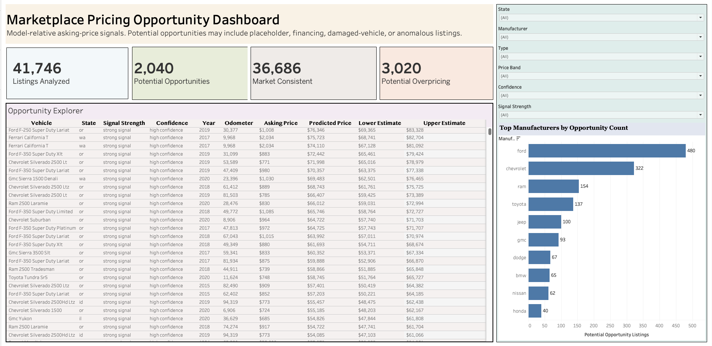
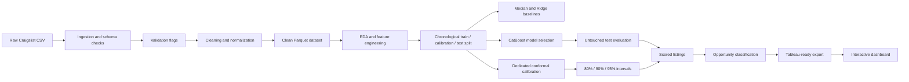

# Uncertainty-Aware Marketplace Pricing Analysis

> An end-to-end machine-learning and business-intelligence project that estimates market-consistent vehicle asking prices, quantifies prediction uncertainty, and surfaces listings that merit further review.


## Project overview

Online vehicle marketplaces are noisy. Listings may contain placeholder prices, financing amounts, missing attributes, repeated vehicles, and rare models with very different pricing behavior from mainstream inventory.

This project builds a reproducible system that answers three questions:

1. **What asking price is market-consistent for this vehicle?**
2. **How uncertain is that estimate?**
3. **Does the listing fall outside the expected range enough to warrant investigation?**

The final product combines a leakage-aware Python modeling pipeline, conformal prediction intervals, segment-level reliability analysis, automated tests, and an interactive Tableau dashboard.

## Key results

| Outcome | Result |
|---|---:|
| Raw Craigslist listings | 426,880 |
| Clean analytical listings | 361,956 |
| Final chronological test listings | 41,746 |
| CatBoost test MAE | **$3,515.95** |
| CatBoost median absolute error | **$1,784.57** |
| MAE improvement over strongest stable baseline | **30.2%** |
| 90% interval empirical test coverage | **87.88%** |
| Potentially underpriced signals | **2,040** |
| Market-consistent listings | **36,686** |
| Potentially overpriced signals | **3,020** |
| Automated tests | **75 passing** |

### Final model comparison

| Model | MAE | RMSE | Median absolute error |
|---|---:|---:|---:|
| Global median | $10,790.70 | $14,497.19 | $9,778.00 |
| Hierarchical segment median | $5,036.32 | $9,204.85 | $2,797.50 |
| **CatBoost** | **$3,515.95** | **$7,351.12** | **$1,784.57** |

CatBoost reduced MAE by approximately **$1,520 per listing** relative to the strongest stable baseline.

## Tableau opportunity dashboard


[](https://public.tableau.com/app/profile/asim.ahmed5467/viz/marketplace_oppurtunity_dashboard/MarketplaceOpportunityDashboard#2)

**[View the interactive Tableau dashboard](https://public.tableau.com/app/profile/asim.ahmed5467/viz/marketplace_oppurtunity_dashboard/MarketplaceOpportunityDashboard#2)**  
**[Download the packaged Tableau workbook](reports/tableau/marketplace_opportunity_dashboard.twbx)**


# The dashboard provides:

- KPI cards for analyzed, potentially underpriced, market-consistent, and potentially overpriced listings
- A ranked listing-level opportunity explorer
- Asking price, predicted price, and 90% lower and upper estimates
- Filters for state, manufacturer, vehicle type, price band, confidence, and signal strength
- A ranked view of manufacturers with the most opportunity signals

> Opportunity labels are model-relative screening signals. They are not verified bargains, transaction prices, or purchasing recommendations.

## Why this project is technically meaningful

### Leakage-aware evaluation

A random split could place reposts of the same vehicle or later marketplace observations into both training and evaluation data. To reduce this risk, the pipeline uses:

- chronological train, calibration, and test periods
- VIN isolation across splits
- training-only segment statistics and model fitting
- an untouched final test set

| Split | Rows |
|---|---:|
| Training | 253,369 |
| Model-selection calibration | 43,600 |
| Final test | 41,746 |
| Cross-split VIN rows removed | 23,241 |

### Baselines before complexity

The project compares CatBoost against three simpler approaches:

- **Global median:** one training-set median price for every listing
- **Hierarchical segment median:** manufacturer, model, and age medians with minimum-support fallbacks
- **Ridge regression:** linear modeling with numeric preprocessing and one-hot encoded categories

The segment median established the strongest stable baseline. Ridge performed reasonably on typical listings but produced an extreme prediction for a rare feature combination, demonstrating why aggregate metrics must be paired with failure-case analysis.

### High-cardinality categorical modeling

CatBoost was selected because vehicle pricing depends on nonlinear interactions and high-cardinality categories such as model, region, manufacturer, and body type.

The selected configuration used:

```text
Depth:          8
Learning rate:  0.10
Best iteration: 997
Trees retained: 998
Objective:      MAE
```

The most influential features were:

| Feature | Importance |
|---|---:|
| Vehicle age | 22.0% |
| Odometer | 12.6% |
| Manufacturer | 9.1% |
| Model | 8.5% |
| Vehicle type | 7.7% |

### Conformal uncertainty

A point prediction alone can hide substantial risk. The project therefore uses split conformal prediction to transform calibration residuals into empirical prediction intervals.

| Nominal interval | Calibration quantile | Test coverage | Average width |
|---|---:|---:|---:|
| 80% | $4,270.11 | 76.66% | $8,363.29 |
| 90% | $6,981.67 | **87.88%** | $13,204.86 |
| 95% | $10,290.61 | 93.67% | $18,551.35 |

Coverage was below nominal on the later chronological test period, suggesting temporal distribution shift.

### Conditional reliability audit

Overall coverage concealed substantial subgroup differences:

| Segment | 90% empirical coverage | MAE |
|---|---:|---:|
| Vehicles priced $50k+ | 23.47% | $20,472 |
| Porsche | 54.76% | $14,831 |
| Vehicles priced $35k–$50k | 60.23% | $7,051 |
| Vehicles aged 0–2 years | 69.15% | $7,582 |
| Vehicles under 25k miles | 70.61% | $7,465 |

This is a central finding: **acceptable marginal coverage does not imply reliable performance for every market segment**.

## Opportunity classification

Each test listing is classified using its asking price and the model's 90% prediction interval:

```text
asking price < lower bound  -> potentially underpriced
asking price within bounds  -> market consistent
asking price > upper bound  -> potentially overpriced
```

Signals are further grouped by relative gap strength and interval-width-based confidence. The result is a prioritization layer for human review, not an automated purchase recommendation.

## System architecture



## Data pipeline

The source dataset contains 426,880 Craigslist vehicle listings. The cleaning pipeline:

- parses and validates listing dates
- enforces defensible price, year, and odometer bounds
- normalizes categorical values
- preserves optional missing categories as `unknown`
- records row-level validation flags
- produces a compact Parquet analytical dataset

The pipeline removed **64,924 rows** and retained **84.79%** of the source data.

## Feature engineering

A centralized feature pipeline creates 21 model features, including:

- vehicle age and mileage per year
- manufacturer, model, and manufacturer-model combination
- condition, fuel, cylinders, transmission, drive, body type, and title status
- region, state, latitude, and longitude
- listing completeness
- posting day of week

Centralizing these transformations keeps training and evaluation logic consistent.

## Repository structure

```text
marketplace-pricing-analysis/
├── data/
│   ├── raw/                  # source CSV; not committed
│   ├── processed/            # cleaned data and chronological splits
│   └── tableau/              # dashboard-ready exports
├── models/                   # generated model artifacts; ignored by Git
├── reports/
│   ├── figures/              # EDA and dashboard images
│   ├── tables/               # metrics, importance, coverage, predictions
│   ├── tableau/              # packaged Tableau workbook
│   ├── baseline_results.md
│   ├── eda_report.md
│   ├── model_card.md
│   └── uncertainty_report.md
├── src/
│   ├── analysis/             # EDA, visualizations, Tableau exports
│   ├── data/                 # ingestion, validation, cleaning, splitting
│   ├── features/             # reusable model feature pipeline
│   ├── models/               # baselines, Ridge, CatBoost, evaluation
│   └── uncertainty/          # conformal intervals and coverage analysis
├── tests/                    # 75 automated tests
├── pyproject.toml
├── uv.lock
└── README.md
```

## Reproduce the project

### Prerequisites

- Python 3.13
- [`uv`](https://docs.astral.sh/uv/)
- Kaggle API credentials
- Tableau Desktop or Tableau Reader to open the packaged workbook
- A web browser to use the live Tableau Public dashboard

### 1. Clone and install

```bash
git clone https://github.com/asim-aa/marketplace-pricing-analysis.git
cd marketplace-pricing-analysis

uv python install 3.13
uv sync
```

### 2. Download the source dataset

```bash
mkdir -p data/raw

uv run kaggle datasets download \
  -d austinreese/craigslist-carstrucks-data \
  -p data/raw

unzip data/raw/craigslist-carstrucks-data.zip -d data/raw
rm data/raw/craigslist-carstrucks-data.zip
```

The expected source file is:

```text
data/raw/vehicles.csv
```

### 3. Run the pipeline

```bash
# Data foundation
uv run python -m src.data.ingestion
uv run python -m src.data.validation
uv run python -m src.data.cleaning

# Market analysis
uv run python -m src.analysis.market_overview
uv run python -m src.analysis.visualizations
uv run python -m src.analysis.tableau_export

# Chronological splitting and baseline evaluation
uv run python -m src.data.splitting
uv run python -m src.models.baselines
uv run python -m src.models.ridge
uv run python -m src.models.evaluate

# CatBoost model selection and final evaluation
uv run python -m src.models.train
uv run python -m src.models.final_evaluation

# Conformal uncertainty and opportunity analysis
uv run python -m src.uncertainty.run_conformal
uv run python -m src.uncertainty.analyze_uncertainty

# Tableau opportunity export
uv run python -m src.analysis.opportunity_tableau_export
```

The trained CatBoost artifact is intentionally excluded from Git because of its size and is regenerated by the training step.

### 4. Validate the codebase

```bash
uv run ruff format --check src tests
uv run ruff check src tests
uv run pytest
```

Expected result:

```text
75 passed
```

## Key artifacts

- [Exploratory analysis report](reports/eda_report.md)
- [Baseline evaluation](reports/baseline_results.md)
- [Final model metrics](reports/tables/final_model_metrics.csv)
- [CatBoost feature importance](reports/tables/catboost_feature_importance.csv)
- [Conformal uncertainty report](reports/uncertainty_report.md)
- [Model card](reports/model_card.md)
- [Conditional coverage metrics](reports/tables/conditional_coverage_metrics.csv)
- [Tableau dashboard workbook](reports/tableau/marketplace_opportunity_dashboard.twbx)

## Limitations

- The target is **advertised asking price**, not verified transaction price or intrinsic vehicle value.
- The data covers **April 4 through May 5, 2021**, so the model should not be interpreted as a current-market estimator.
- Listings may contain financing amounts, placeholder prices, damaged vehicles, scams, or data-entry errors.
- Repeated VINs indicate reposted physical vehicles; split isolation reduces leakage but cannot remove every marketplace dependency.
- Global symmetric conformal intervals substantially under-cover rare and expensive segments.
- “Potentially underpriced” means outside the model's expected range and worthy of investigation, not a confirmed bargain.
- The system is not intended for automated purchasing, lending, insurance, or other high-stakes valuation decisions.

## What this project demonstrates

- reproducible data ingestion, validation, and cleaning
- leakage-aware chronological evaluation
- baseline design and failure-case analysis
- high-cardinality categorical modeling with CatBoost
- conformal prediction and empirical coverage auditing
- segment-level reliability analysis
- Python-to-Tableau analytical data pipelines
- dashboard design and business communication
- automated testing, linting, and version-controlled development

## Author

**Asim Ahmed**

[GitHub](https://github.com/asim-aa) · [LinkedIn](https://www.linkedin.com/in/asim-ahmed-129450365/)

---

*This project is an analytical and educational decision-support system. It does not provide financial, purchasing, or valuation advice.*