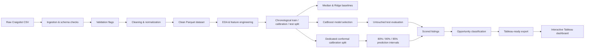

# Uncertainty-Aware Marketplace Pricing & Opportunity Analysis

> An end-to-end machine-learning and business-intelligence system that estimates market-consistent vehicle asking prices, quantifies prediction uncertainty, and surfaces listings that warrant further investigation.


## Why this project

Marketplace listings are noisy: prices may be unrealistic, attributes are frequently missing, vehicles are reposted, and rare models behave very differently from mainstream inventory. A point prediction alone is therefore not enough.

This project answers three practical questions:

1. **What asking price is market-consistent for this vehicle?**
2. **How uncertain is that estimate?**
3. **Does the listing fall far enough outside the expected range to merit investigation?**

The result is a reproducible Python pipeline plus an interactive Tableau decision dashboard—not merely a model notebook.

## Results at a glance

| Outcome | Result |
|---|---:|
| Raw Craigslist listings | 426,880 |
| Clean analytical listings | 361,956 |
| Final chronological test listings | 41,746 |
| CatBoost test MAE | **$3,515.95** |
| CatBoost median absolute error | **$1,784.57** |
| MAE improvement over strongest stable baseline | **30.2%** |
| Nominal 90% interval test coverage | **87.88%** |
| Potentially underpriced signals | **2,040** |
| Market-consistent listings | **36,686** |
| Potentially overpriced signals | **3,020** |
| Automated tests | **75 passing** |

### Final model comparison

| Model | MAE | RMSE | Median absolute error |
|---|---:|---:|---:|
| Global median | $10,790.70 | $14,497.19 | $9,778.00 |
| Hierarchical segment median | $5,036.32 | $9,204.85 | $2,797.50 |
| **CatBoost** | **$3,515.95** | **$7,351.12** | **$1,784.57** |

CatBoost reduced average test error by **$1,520 per listing** relative to the strongest stable baseline.

## Dashboard

[](reports/tableau/marketplace_opportunity_dashboard.twbx)

The Tableau dashboard provides:

- KPI cards for analyzed, potentially underpriced, market-consistent, and potentially overpriced listings
- A ranked listing-level opportunity explorer
- Predicted prices and 90% lower/upper estimates
- Filters for state, manufacturer, vehicle type, price band, confidence, and signal strength
- A ranked view of manufacturers with the most opportunity signals

**[Download the packaged Tableau workbook](reports/tableau/marketplace_opportunity_dashboard.twbx)**

> Opportunity labels are model-relative screening signals. They are not verified bargains, transaction prices, or purchasing recommendations.

## System architecture



## Modeling approach

### 1. Data quality pipeline

The raw dataset contained extreme prices, impossible or missing core values, very high mileage, and repeated VINs. The pipeline:

- parses and validates listing dates
- enforces defensible price, year, and odometer bounds
- normalizes categorical values
- preserves optional missing attributes as `unknown`
- records row-level validation flags
- produces a compact Parquet analytical dataset

The cleaning rules removed **64,924 rows** and retained **84.79%** of the source data.

### 2. Leakage-aware evaluation

Random splitting would overstate performance because later listings and reposted vehicles could leak information backward. The project instead uses:

- a **chronological** train/calibration/test split
- VIN separation across splits
- training-only model fitting and segment statistics
- an untouched final test period

The split contained:

| Split | Rows |
|---|---:|
| Train | 253,369 |
| Model-selection calibration | 43,600 |
| Final test | 41,746 |
| Cross-split VIN rows removed | 23,241 |

### 3. Baselines before complexity

Three baselines established a credible performance floor:

- **Global median:** one training-set price for every listing
- **Hierarchical segment median:** manufacturer/model/age medians with minimum-support fallbacks
- **Ridge regression:** linear modeling with numeric preprocessing and one-hot encoded categories

The segment median was the strongest stable baseline. Ridge captured useful signal for typical listings but produced an extreme failure on a rare feature combination, reinforcing the need for nonlinear modeling and error analysis.

### 4. Feature engineering

A centralized feature pipeline creates **21 model features**, including:

- vehicle age
- odometer
- mileage per year
- manufacturer and model
- manufacturer-model combination
- condition, fuel, cylinders, transmission, drive, body type, and title status
- region, state, latitude, and longitude
- listing completeness
- posting day of week

Centralizing these transformations ensures training and inference use identical logic.

### 5. CatBoost model selection

CatBoost was selected because the dataset contains nonlinear relationships and high-cardinality categorical variables such as vehicle model and region.

Three candidate configurations were evaluated on the chronological calibration split. The selected configuration used:

```text
Depth:          8
Learning rate:  0.10
Best iteration: 997
Trees retained: 998
Objective:      MAE
```

The most influential features were vehicle age, odometer, manufacturer, model, vehicle type, cylinders, fuel, and drivetrain.

## Uncertainty with split conformal prediction

A point estimate can hide substantial risk, especially for rare or expensive vehicles. The project therefore retrains the fixed CatBoost configuration on a proper-training subset and calibrates absolute residuals on a later dedicated conformal subset.

| Nominal interval | Calibration quantile | Test coverage | Median width |
|---|---:|---:|---:|
| 80% | $4,270.11 | 76.66% | $8,540.22 |
| 90% | $6,981.67 | **87.88%** | $13,963.33 |
| 95% | $10,290.61 | 93.67% | $20,581.23 |

Observed coverage was modestly below nominal coverage on the later test period, which is consistent with temporal distribution shift.

### Conditional reliability audit

Marginal coverage concealed major subgroup differences:

| Segment | 90% empirical coverage | MAE |
|---|---:|---:|
| $50k+ vehicles | 23.47% | $20,472 |
| Porsche | 54.76% | $14,831 |
| $35k–$50k vehicles | 60.23% | $7,051 |
| Vehicles aged 0–2 years | 69.15% | $7,582 |
| Vehicles under 25k miles | 70.61% | $7,465 |

This audit is a central project finding: **acceptable overall coverage does not imply reliable coverage for every market segment**.

## Opportunity logic

For each test listing:

```text
asking price < 90% lower bound  -> potentially underpriced
asking price within interval    -> market consistent
asking price > 90% upper bound  -> potentially overpriced
```

Signals are further grouped by relative gap strength and interval-width-based confidence. This creates a decision-support layer while preserving uncertainty and model limitations.

## Repository structure

```text
marketplace-pricing-analysis/
├── data/
│   ├── raw/                  # source CSV (not committed)
│   ├── processed/            # cleaned data and chronological splits
│   └── tableau/              # dashboard-ready exports
├── models/                   # generated model artifacts (ignored by Git)
├── reports/
│   ├── figures/              # EDA and dashboard images
│   ├── tables/               # metrics, importance, coverage, predictions
│   ├── tableau/              # packaged Tableau workbook
│   ├── baseline_results.md
│   ├── eda_report.md
│   └── uncertainty_report.md
├── src/
│   ├── analysis/             # EDA, visualizations, Tableau exports
│   ├── data/                 # ingestion, validation, cleaning, splitting
│   ├── features/             # reusable model feature pipeline
│   ├── models/               # baselines, Ridge, CatBoost, evaluation
│   └── uncertainty/          # conformal intervals and coverage analysis
├── tests/                    # 75 automated tests
├── pyproject.toml
├── uv.lock
└── README.md
```

## Reproduce the project

### Prerequisites

- Python 3.13
- [`uv`](https://docs.astral.sh/uv/)
- Kaggle API credentials for downloading the source dataset
- Tableau Desktop or Tableau Reader to open the packaged workbook

### 1. Clone and install

```bash
git clone https://github.com/asim-aa/marketplace-pricing-analysis.git
cd marketplace-pricing-analysis
uv sync
```

### 2. Download the dataset

```bash
mkdir -p data/raw
uv run kaggle datasets download \
  -d austinreese/craigslist-carstrucks-data \
  -p data/raw

unzip data/raw/craigslist-carstrucks-data.zip -d data/raw
rm data/raw/craigslist-carstrucks-data.zip
```

This should create:

```text
data/raw/vehicles.csv
```

### 3. Run the pipeline

```bash
# Data foundation
uv run python -m src.data.ingestion
uv run python -m src.data.validation
uv run python -m src.data.cleaning

# Market analysis
uv run python -m src.analysis.market_overview
uv run python -m src.analysis.visualizations
uv run python -m src.analysis.tableau_export

# Chronological evaluation and baselines
uv run python -m src.data.splitting
uv run python -m src.models.evaluate

# CatBoost selection and final evaluation
uv run python -m src.models.train
uv run python -m src.models.final_evaluation

# Conformal uncertainty and opportunity analysis
uv run python -m src.uncertainty.run_conformal
uv run python -m src.uncertainty.analyze_uncertainty

# Final Tableau export
uv run python -m src.analysis.opportunity_tableau_export
```

CatBoost model selection is the most compute-intensive step; runtime depends on hardware.

### 4. Validate the codebase

```bash
uv run ruff format --check src tests
uv run ruff check src tests
uv run pytest
```

Expected result:

```text
75 passed
```

## Key artifacts

- [Exploratory analysis report](reports/eda_report.md)
- [Baseline evaluation](reports/baseline_results.md)
- [Final model metrics](reports/tables/final_model_metrics.csv)
- [CatBoost feature importance](reports/tables/catboost_feature_importance.csv)
- [Conformal uncertainty report](reports/uncertainty_report.md)
- [Conditional coverage metrics](reports/tables/conditional_coverage_metrics.csv)
- [Tableau dashboard workbook](reports/tableau/marketplace_opportunity_dashboard.twbx)

## Limitations

- The target is **advertised asking price**, not verified transaction price or intrinsic vehicle value.
- The dataset covers only **April 4–May 5, 2021**, so results should not be interpreted as current market estimates.
- Craigslist listings may contain financing amounts, placeholder prices, damaged vehicles, scams, or data-entry errors.
- Repeated VINs indicate reposted physical vehicles; split isolation reduces leakage but does not remove all marketplace dependence.
- Global symmetric conformal intervals substantially under-cover rare and expensive segments.
- “Potentially underpriced” means **outside the model’s expected range and worthy of investigation**, not a confirmed bargain.
- The model is not intended for automated purchasing, lending, insurance, or high-stakes valuation decisions.

## What this project demonstrates

- Reproducible data ingestion, validation, and cleaning
- Leakage-aware chronological model evaluation
- Baseline discipline and failure-case analysis
- High-cardinality categorical modeling with CatBoost
- Conformal prediction and empirical coverage auditing
- Segment-level reliability analysis
- Python-to-Tableau analytical data pipelines
- Interactive dashboard design and business communication
- Automated testing, linting, and version-controlled project organization

## Future improvements

- Replace the global residual interval with normalized or group-conditional conformal prediction
- Retrain on newer data and evaluate rolling temporal recalibration
- Build a separate anomaly classifier for financing, placeholder, and suspicious prices
- Publish the workbook to Tableau Public for browser-based interaction

## Author

**Asim Ahmed**  
[GitHub](https://github.com/asim-aa)

---

This project is intended as an analytical and educational decision-support system. It does not provide financial, purchasing, or valuation advice.